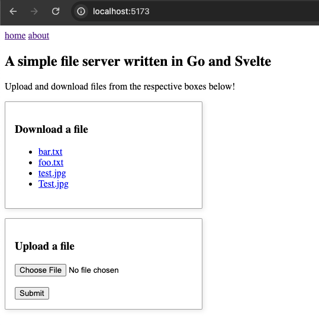
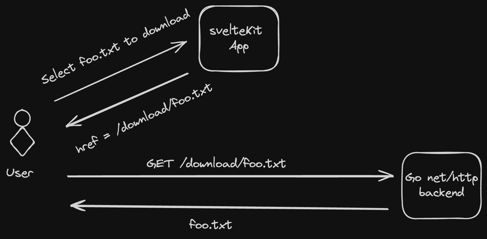
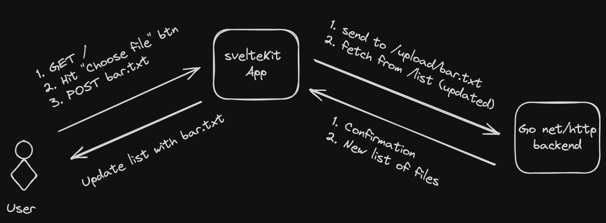

#### Overview
A small learning exercise by writing a basic file server in Go

UPDATE: Basic frontend using sveltekit was added latest (check the [frontend](#frontend) section)

#### Build
`docker build -t file-server-go .`

#### Run
`docker run --memory="64m" --memory-swap="100m" -p 37899:37899 file-server-go`

##### Observations:
- Running the `free -h` command from within the container will show incorrect results (see [this](https://stackoverflow.com/a/72185762/768020) answer)
    
    For instance, with the memory flag set to `64M` and the swap flag set to `100M` (effective swap is `100 - 64` = `36M`);

    `free -h` (from inside container):
    ```
                  total        used        free      shared  buff/cache   available
    Mem:           2.9G        1.4G      259.6M       29.4M        1.2G        1.1G
    Swap:        512.0M      200.0M      312.0M
    ```

    `docker inspect <container-id>` (from the host, i.e. outside the container)
    ```
    CONTAINER ID   NAME               CPU %     MEM USAGE / LIMIT   MEM %     NET I/O       BLOCK I/O        PIDS
    8300bf4be0ba   quizzical_panini   0.00%     1.465MiB / 64MiB    2.29%     1.09kB / 0B   266kB / 12.3kB   7
    ```

- Prior to using `io.copy` (and reading the entire file in memory) would result in an OOM if the file size is > 64MB
```
...
Containers:
  file-server-instance:
    Container ID:   containerd://bf13bd5b2e61eeae85b6c7a4f138dd1f66c525c2a78ca22cd2415bb373349c92
    Image:          file-server-go:0.0.1
    Image ID:       docker.io/library/import-2024-01-13@sha256:26ba3255996d8630e54fbca83d0f4b128bd12fae4039ddbd810089cd66e26507
    Port:           37899/TCP
    Host Port:      0/TCP
    State:          Running
      Started:      Sat, 13 Jan 2024 11:56:49 -0800
    Last State:     Terminated
      Reason:       OOMKilled
      Exit Code:    137
      Started:      Sat, 13 Jan 2024 11:56:34 -0800
      Finished:     Sat, 13 Jan 2024 11:56:49 -0800
    Ready:          True
    Restart Count:  1
    Limits:
apiVersion: apps/v1
      cpu:     1
      memory:  64M
    Requests:
      cpu:        700m
      memory:     64M
    Environment:  <none>
```

#### Frontend

###### Homepage GUI


###### List files flow


###### Download flow


###### Upload flow

